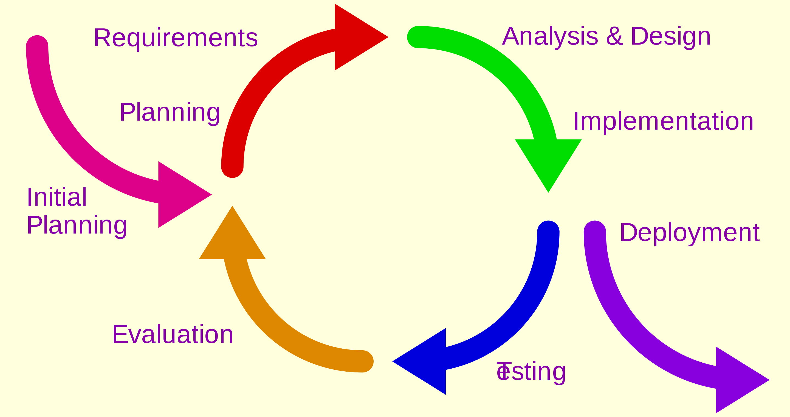

# Best Practices
This repository is about software engineering &amp; development best practices.

Before understanding about different best practices it is a must to understand and know 
about some common causes of software development problems.

* End-user needs was not clear or understood inaccurately.
    - Without clear understanding of ultimate goal(End-user requirement) it is not possible to develop software that will satisfy end-users. 
* Inability to deal with **changing requirement**. 
* Modules that don't fit together.
* Software that is hard to **maintain** or **extend**.
* Critical flaws in the project discovered lately.
* Poor software quality
* Unacceptable software performance.
* Team members in each other's way, making it impossible to reconstruct who changed what, when, where, and why?
* An untrustworthy build-and-release process.

There are the projects starts at high speed but can't survive the MVP or passing the MVP project faces difficulties
running smoothly, and lot of projects fail. Although different projects fail for different reasons, it appears that
most of them fail because of causes mentioned below:

* Ad hoc requirements management.
* Ambiguous and imprecise communication. 
* Weakly designed architectures with critical flaws. 
* Unnecessarily made it complex or Overwhelming complexity
* Ambiguous requirements which leads to inconsistencies designs,
  and implementations.
* Insufficient/Poor testing.
* Subjective project status assessment.
* Failure to attack risk.
* Uncontrolled change propagation.
* Insufficient automation.

### Some best practices
Here are some best practices which are industry proven: 
1. Follow iterative development, 
2. Manage requirements properly.
3. Use component-based architectures instead of monolithic architecture.
4. Visually model software.
5. Verify software quality.
6. Control changes to software.

#### Iterative development
Classic software development processes follow the waterfall life cycle. In this approach, development proceeds linearly from requirements analysis through design, code and unit testing, subsystem testing, and system testing.

The fundamental problem of this approach is that it pushes risk forward in time so that it’s costly to undo mistakes from earlier
phases. An initial design will likely be flawed with respect to its key requirements, and, furthermore, the late discovery of design 
defects tends to result in costly overruns or project cancellation. 

An alternative to the waterfall approach is the iterative and incremental
process, as shown in Figure

In this approach, building on the work on spiral
model the identification of risks to a project is forced early in the
life cycle, when it’s possible to attack and react to them in a timely
and efficient manner.
This approach is one of continuous discovery, invention, and
implementation, with each iteration forcing the development team to drive the project’s artifacts to closure in a predictable and repeatable
way.

Developing software iteratively offers a number of solutions to
the root causes of software development problems.
1. Serious misunderstandings are made evident early in the
life cycle, when it’s possible to react to them.
2. This approach enables and encourages user feedback so as
to elicit the system’s real requirements.
3. The development team is forced to focus on those issues that
are most critical to the project and are shielded from those
issues that distract them from the project’s real risks.
4. Continuous, iterative testing enables an objective assessment
of the project’s status.
5. Inconsistencies among requirements, designs, and implementations
are detected early.
6. The workload of the team, especially the testing team, is
spread out more evenly throughout the life cycle.
7. The team can leverage lessons learned and therefore can
continuously improve the process.
8. Stakeholders in the project can be given concrete evidence
of the project’s status throughout the life cycle.

#### Requirements management
The challenge of managing the requirements of a software-intensive
system is that they are dynamic: you must expect them to change
during the life of a software project. Furthermore, identifying a
system’s true requirements—those that weigh most heavily on the
system’s economic and technical goals—is a continuous process.

Except for the most trivial system, it is impossible to completely and
exhaustively state a system’s requirements before the start of development.

A requirement is a condition or capability a system must meet.
The active management of requirements encompasses three activities:
eliciting, organizing, and documenting the system’s required
functionality and constraints; evaluating changes to these requirements and assessing their impact; and tracking and documenting
trade-offs and decisions. Managing the requirements of your project offers a number of
solutions to the root causes of software development problems.

1. A disciplined approach is built into requirements
management.
2. Communications are based on defined requirements.
3. Requirements can be prioritized, filtered, and traced.
4. An objective assessment of functionality and performance is
possible.
5. Inconsistencies are more easily detected.
6. With suitable tool support, it is possible to provide a repository
for a system’s requirements, attributes, and traces,
with automatic links to external documents.

### References
* The Rational Unified Process An Introduction by *Philippe Kruchten*

